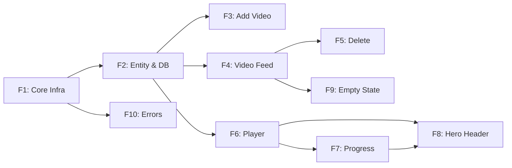

# SkillTube — Feature Specifications (Clean Architecture)

> **Source of Truth:** [app_and_features.md](../app/app_and_features.md) (PRD v3.0)
> **Architecture:** [clean_architecture_guide.md](../architecture/clean_architecture_guide.md)
> **Version:** 1.0 · **Updated:** 2026-02-12

---

## Module Map

| Module | Path | Features |
|--------|------|----------|
| **Core** | `lib/src/core/` | F1 (Infrastructure), F10 (Error Handling) |
| **Library** | `lib/src/features/library/` | F2 (Entity & DB), F3 (Add Video), F4 (Feed), F5 (Delete), F8 (Hero Header), F9 (Empty State) |
| **Player** | `lib/src/features/player/` | F6 (Landscape Player), F7 (Progress Persistence) |

## Build Order

| Phase | Features | Goal |
|-------|----------|------|
| **P0** | F1 → F2 → F3 → F4 → F6 → F7 | Core loop: add, watch, auto-save |
| **P1** | F5, F8, F10 | Delete, hero header, error toasts |
| **P2** | F9 | Empty state |



---
---

## F1 — Core Infrastructure

> PRD §2 · 🔴 P0 · Depends on: —

### What It Does
Sets up the app skeleton: routing, dependency injection, theme, logging, and orientation locking.

### Files

| Layer | File | Responsibility |
|-------|------|----------------|
| Router | `core/router/app_router.dart` | GoRouter: `/` → DashboardPage, `/player/:videoId` → PlayerPage |
| DI | `core/di/injection_container.dart` | `get_it` registrations for Store, DataSources, Repos, UseCases, Blocs |
| Bootstrap | `bootstrap.dart` | Init ObjectBox, Firebase, Talker. Call DI. Lock portrait globally |
| App | `app.dart` | `MaterialApp.router` with GoRouter, M3 dark theme, `TalkerRouteObserver` |
| Error | `core/error/exception.dart` | Add `VideoException` (with `code` field). Remove `AuthException` |
| Error | `core/error/failure.dart` | Add `VideoFailure`. Remove `AuthFailure` |
| Theme | `core/theme/app_theme.dart` | Material 3, centralized dark theme, no inline styles |
| Logging | `core/services/logging/` | Talker + `firebase_crashlytics` init |

### Acceptance Criteria
- [ ] App boots to Dashboard route (`/`)
- [ ] Portrait locked on Dashboard
- [ ] DI container provides all registered dependencies
- [ ] Talker logging active

---
---

## F2 — Video Entity & Database

> PRD §6 + [video_entity_schema.md](../data/video_entity_schema.md) · 🔴 P0 · Depends on: F1

### What It Does
Defines the Video data model and ObjectBox persistence across all Clean Architecture layers.

### Domain Layer — `features/library/domain/`

| File | Content |
|------|---------|
| `entities/video.dart` | `@freezed` entity with fields: `id`, `youtubeId`, `title`, `channelName`, `thumbnailUrl`, `durationSeconds`, `lastWatchedPositionSeconds`, `addedAt`, `lastPlayedAt` |
| `repositories/video_repository.dart` | Abstract interface: `getAllVideos()`, `getLastPlayedVideo()`, `addVideo()`, `deleteVideo()` |

**Computed Properties** (on entity):

| Property | Logic |
|----------|-------|
| `progressPercent` | `lastWatchedPositionSeconds / durationSeconds` |
| `isCompleted` | `progressPercent > 0.95` |
| `hasBeenPlayed` | `lastPlayedAt != null` |

### Data Layer — `features/library/data/`

| File | Content |
|------|---------|
| `models/video_model.dart` | ObjectBox `@Entity()` with `@Unique()` on `youtubeId`, `@Property(type: PropertyType.dateNano)` on dates. Has `toEntity()` and `fromEntity()` |
| `datasources/video_local_datasource.dart` | ObjectBox Box CRUD: put, remove, getAll, query by youtubeId, query lastPlayed |
| `repositories/video_repository_impl.dart` | Implements domain interface. Maps `DatabaseException` → `CacheFailure` |

### Acceptance Criteria
- [ ] Video entity has all 9 fields from schema
- [ ] ObjectBox store opens and persists across app restarts
- [ ] Unique constraint on `youtubeId` prevents duplicates
- [ ] `toEntity()` / `fromEntity()` roundtrip correctly

---
---

## F3 — Add Video

> PRD §7.1 · 🔴 P0 · Depends on: F2

### What It Does
User taps FAB → modal with URL input → fetches YouTube metadata → saves to ObjectBox.

### Domain Layer

| File | Content |
|------|---------|
| `usecases/add_video.dart` | `call(String url)` → `ResultFuture<Video>` |

### Data Layer

| File | Content |
|------|---------|
| `datasources/video_remote_datasource.dart` | `youtube_explode_dart` — extracts `youtubeId` from URL, fetches title, thumbnail, channel, duration |
| `repositories/video_repository_impl.dart` | Validate URL → check duplicate `youtubeId` → fetch metadata → save to ObjectBox. Catches exceptions → returns `Left(VideoFailure)` |

### Presentation Layer

| File | Content |
|------|---------|
| `widgets/add_video_fab.dart` | Material 3 FAB, pinned bottom-right on Dashboard |
| `widgets/add_video_modal.dart` | URL text field + "Auto-Paste" button (clipboard grab). Submit triggers `AddVideoEvent` |
| `bloc/library_bloc.dart` | `AddVideoEvent(url)` → `LibraryLoading` → `LibraryLoaded` / `LibraryError(failure)` |

### Error Scenarios

| Condition | Toast Message |
|-----------|---------------|
| Invalid URL | "Please paste a valid YouTube link." |
| Duplicate | "This video is already in your library." |
| Offline | "No internet connection. Cannot fetch video details." |
| Unavailable | "Video is private or deleted." |

### Acceptance Criteria
- [ ] FAB visible on Dashboard at all times
- [ ] Auto-Paste grabs YouTube link from clipboard
- [ ] Metadata (title, thumbnail, channel, duration) saved correctly
- [ ] Duplicate detection works via `youtubeId` unique check
- [ ] All 4 error toasts display correctly

---
---

## F4 — Video Feed (List)

> PRD §3.2 · 🔴 P0 · Depends on: F2

### What It Does
A flat, vertical-scrolling list of all saved videos displayed below the Hero Header.

### Domain Layer

| File | Content |
|------|---------|
| `usecases/get_all_videos.dart` | `call()` → `ResultFuture<List<Video>>` |

### Presentation Layer

| File | Content |
|------|---------|
| `pages/dashboard_page.dart` | Scaffold: Hero Header (top) + Video Feed (body) + FAB (bottom-right) |
| `widgets/video_feed.dart` | `ListView.builder` rendering `VideoCard` widgets |
| `widgets/video_card.dart` | Static thumbnail + title + channel + duration + **blue progress bar** at bottom |

### Behavior Rules
- **No auto-play.** Cards show static thumbnails only — no inline iframe playback.
- **Tap** → navigate directly to Landscape Focus Mode (`/player/:videoId`).
- **Progress bar** reflects `progressPercent` from database.
- **Sort order:** `addedAt` descending (newest first).

### Acceptance Criteria
- [ ] All saved videos appear in the feed
- [ ] Each card displays thumbnail, title, channel, duration
- [ ] Progress bar reflects actual watch progress
- [ ] Tapping a card navigates to `/player/:videoId`
- [ ] No iframe players load in the feed

---
---

## F5 — Delete Video

> PRD §7.2 · 🟡 P1 · Depends on: F4

### What It Does
Long-press on a feed card → confirmation dialog → delete video and watch history.

### Domain Layer

| File | Content |
|------|---------|
| `usecases/delete_video.dart` | `call(int id)` → `ResultFuture<void>` |

### Presentation Layer

| File | Content |
|------|---------|
| `widgets/video_card.dart` | `onLongPress` → show `AlertDialog` with confirm/cancel |
| `bloc/library_bloc.dart` | `DeleteVideoEvent(id)` → remove from ObjectBox → re-emit updated list |

### Acceptance Criteria
- [ ] Long-press triggers confirmation dialog
- [ ] Confirming removes video + all watch data from ObjectBox
- [ ] Feed list updates immediately after deletion
- [ ] If deleted video was the Hero video, Hero updates to next most recent

---
---

## F6 — Landscape Focus Mode (Player)

> PRD §4 · 🔴 P0 · Depends on: F2

### What It Does
Full-screen landscape player with MX Player–style gesture controls and a tap-to-toggle HUD.

### Presentation Layer — `features/player/presentation/`

| File | Content |
|------|---------|
| `pages/player_page.dart` | Fullscreen player page. Wraps `omni_video_player`. Queries DB for auto-resume position |
| `widgets/player_hud.dart` | Overlay: center play/pause/replay + buffering indicator, top bar, bottom seek bar |
| `bloc/player_bloc.dart` | `LoadVideoEvent(videoId)` → query position → seek. Manages HUD visibility, gesture state |

### Gesture Zones

| Gesture | Effect |
|---------|--------|
| Left half — vertical swipe | **Brightness** up/down |
| Right half — vertical swipe | **Volume** up/down |
| Horizontal swipe (anywhere) | **Seek / scrub** timeline |
| Pinch out | **Crop to fill** (remove black bars) |
| Pinch in | **Fit to screen** (original aspect) |
| Tap blank area | **Toggle HUD** visibility |

### HUD Layout

| Zone | Content |
|------|---------|
| **Center** | Large Play / Pause / Replay icon + Buffering spinner |
| **Top bar** | Back button · Marquee title · 3-dot menu |
| **Bottom bar** | Draggable seek bar (with buffer overlay) · Current time / Duration |

### Options Menu (3-dot)

| Option | Values |
|--------|--------|
| Quality | Auto, 1080p, 720p, 480p, 360p |
| Speed | 0.25×, 0.5×, 0.75×, 1.0×, 1.25×, 1.5×, 1.75×, 2.0× |
| Captions | On / Off (YouTube CC tracks) |

### Exit Path
- **Back** or **swipe down** → return to Dashboard.
- Video state preserved in Hero Header (§F8).

### Acceptance Criteria
- [ ] Orientation locks to landscape on entry
- [ ] All 6 gestures work correctly
- [ ] HUD auto-hides after inactivity
- [ ] Quality, speed, captions menus functional
- [ ] Back returns to Dashboard in portrait

---
---

## F7 — Progress Persistence

> PRD §6 · 🔴 P0 · Depends on: F6

### What It Does
Automatically saves watch position. No manual "Mark as Complete". User never loses their place.

### Domain Layer — `features/player/domain/`

| File | Content |
|------|---------|
| `repositories/playback_repository.dart` | Abstract: `saveProgress(videoId, positionSeconds)`, `getProgress(videoId)` |
| `usecases/save_watch_progress.dart` | `call(videoId, positionSeconds)` → `ResultFuture<void>`. Applies >95% completion reset |
| `usecases/get_watch_progress.dart` | `call(videoId)` → `ResultFuture<int>` (seconds). Handles duration mismatch reset |

### Data Layer — `features/player/data/`

| File | Content |
|------|---------|
| `datasources/playback_local_datasource.dart` | Writes `lastWatchedPositionSeconds` + `lastPlayedAt` to ObjectBox |
| `repositories/playback_repository_impl.dart` | Maps `DatabaseException` → `CacheFailure` |

### Presentation Layer

| File | Content |
|------|---------|
| `bloc/player_bloc.dart` | Manages save triggers + heartbeat timer |

### Save Triggers (Event-Based — Instant)

| Trigger | When |
|---------|------|
| **Pause** | User taps pause |
| **Navigation** | User exits landscape or minimizes |
| **App lifecycle** | App goes to background |
| **Dispose** | Player widget destroyed |

### Heartbeat Save
- Every **60 seconds** during active playback.
- Worst-case data loss: 60 seconds.
- Timer starts on play, pauses on pause/background, cancels on dispose.

### Edge Cases

| Case | Behavior |
|------|----------|
| **>95% watched** | `lastWatchedPositionSeconds = 0`. Next open starts from beginning |
| **Duration mismatch** | If stored position > video duration, reset to `0` |

### Implementation Notes
- The `PositionChanged` listener feeds both the event-based triggers and the heartbeat timer.

### UI Sync
- On return to Dashboard, **both** Hero Header and feed card progress bars reactively update.
- All database writes are **asynchronous** — never block UI.

### Acceptance Criteria
- [ ] Progress saves on pause, exit, background, and dispose
- [ ] 60-second heartbeat fires during playback
- [ ] Auto-resume seeks to stored `lastWatchedPositionSeconds` on video open
- [ ] >95% completion resets to 0:00
- [ ] Duration mismatch resets to 0:00
- [ ] Hero + feed progress bars update on return

---
---

## F8 — Hero Header

> PRD §3.1, §5 · 🟡 P1 · Depends on: F6, F7

### What It Does
Sticky section at the top of Dashboard showing the last-played video with inline playback.

### Domain Layer

| File | Content |
|------|---------|
| `usecases/get_last_played_video.dart` | `call()` → `ResultFuture<Video>`. Query: `lastPlayedAt DESC LIMIT 1`. Fallback: `addedAt DESC LIMIT 1` |

### Presentation Layer

| File | Content |
|------|---------|
| `widgets/hero_header.dart` | Sticky top widget. Thumbnail + badge + Play icon + Full-Screen icon |
| `bloc/library_bloc.dart` | Holds `heroVideo` in state. Re-queries on return from player |

### States

| State | Display |
|-------|---------|
| **Never played** (all `lastPlayedAt` = null) | Most recently added video. Badge: **"Play"** |
| **Has played history** | Last played video. Badge: **"Resume"** |
| **Inline playing** | Video plays in portrait inside Hero. User can scroll feed |

### Behavior Rules
- **Touch-Lock:** Tapping the video body itself = **no-op**. Prevents accidental interaction while scrolling.
- **Play icon tap** → starts video inline in portrait inside Hero.
- **Full-Screen icon tap** → navigates to `/player/:videoId` (Landscape Focus Mode).
- **Return from landscape** → video continues playing (or pauses) inside Hero.
- **No mini-player.** No floating bottom bar. Hero is the **only** inline player.
- **Scrolling** → Hero stays at top. Scrolling feed pushes Hero out of view.

### Acceptance Criteria
- [ ] Shows last-played video (or fallback to newest added)
- [ ] Badge reads "Resume" or "Play" correctly
- [ ] Play icon starts inline portrait playback
- [ ] Full-screen icon navigates to landscape player
- [ ] Touch-lock prevents body taps
- [ ] Video continues in Hero when returning from landscape
- [ ] Scrolling the feed pushes Hero out of view (no sticky pin)

---
---

## F9 — Empty State

> PRD §3.3 · 🟢 P2 · Depends on: F4

### What It Does
Displayed when the database has 0 videos. Guides the user to add their first video.

### Presentation Layer

| File | Content |
|------|---------|
| `widgets/empty_state.dart` | Centered illustration + text + "Add Video" button |
| `bloc/library_bloc.dart` | Emits `LibraryEmpty` state when `videos.isEmpty` |

### Display
- **Illustration:** "Zen Mode" style (distraction-free).
- **Text:** *"No videos strictly meant for learning."*
- **Button:** "Add Video" → opens the URL input modal (same as FAB).

### Acceptance Criteria
- [ ] Shows when database has 0 videos
- [ ] "Add Video" button opens URL input modal
- [ ] Disappears when first video is added
- [ ] Asset/illustration exists (needs to be created)

---
---

## F10 — Error Handling (Global)

> PRD §7.3, [error_protocol.md](../data/error_protocol.md) · 🟡 P1 · Depends on: F1

### What It Does
All errors shown as toasts via `toastification`, triggered from `BlocListener` on error states. No modal dialogs for errors.

### Core Layer

| File | Content |
|------|---------|
| `error/exception.dart` | `VideoException` with `code` field: `invalidUrl`, `videoUnavailable`, `duplicate` |
| `error/failure.dart` | `VideoFailure` maps from `VideoException`. User-friendly message based on `code` |

### Error Message Catalog

| Code | Toast Message |
|------|---------------|
| `invalidUrl` | "Please paste a valid YouTube link." |
| `offline` | "No internet connection. Cannot fetch video details." |
| `videoUnavailable` | "Video is private or deleted." |
| `duplicate` | "This video is already in your library." |

### Flow
```
DataSource throws VideoException(code: 'invalidUrl')
    → Repository catches → returns Left(VideoFailure(message: '...'))
    → Bloc emits ErrorState(failure)
    → BlocListener shows toastification toast
```

### Acceptance Criteria
- [ ] All 4 error scenarios produce correct toast messages
- [ ] Toasts auto-dismiss (no manual close required)
- [ ] No modal dialogs used for errors
- [ ] Error states are recoverable (user can retry)
