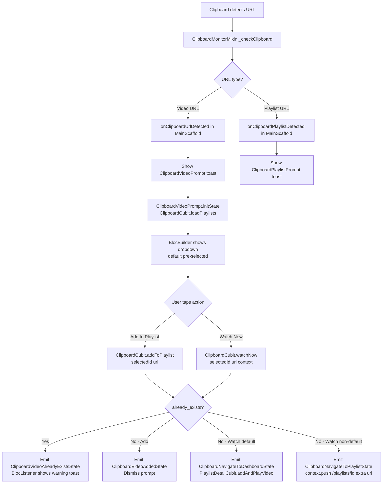

# Clipboard Video Prompt — Playlist Selector Feature (v3)

## Goal

Refactor the clipboard video detection feature into its own proper feature module under
`lib/src/features/clipboard/` with a dedicated `ClipboardCubit`. Then extend it with:

1. **Playlist selector dropdown** in the toast widget — loaded fresh each time the toast appears
2. **"Add to Playlist"** → adds to the selected playlist (default or non-default)
3. **"Watch Now"** → plays on Dashboard if default, navigates to Playlist Detail page if non-default
4. **Duplicate detection** → emits `ClipboardVideoAlreadyExistsState`, shown as a toast via `BlocListener`

---

## Architecture Overview



---

## New Feature Structure

```
lib/src/features/clipboard/
├── viewmodels/
│   ├── clipboard_cubit.dart          [NEW]
│   └── clipboard_state.dart          [NEW]
└── views/
    ├── clipboard_video_prompt.dart   [MOVED from library/views/dashboard_widgets/]
    └── clipboard_playlist_prompt.dart [MOVED from library/views/dashboard_widgets/]
```

---

## Key Design Decisions

> [!IMPORTANT]
> **`ClipboardCubit` talks directly to `PlaylistRepository`** — same pattern as `PlaylistDetailCubit`
> and `SettingsCubit`. It does NOT delegate through other cubits.
> It fetches playlists itself and handles all add/watch logic independently.

> [!IMPORTANT]
> **`ClipboardVideoPrompt` calls `ClipboardCubit.loadPlaylists()` in its `initState()`** — NOT in
> `MainScaffold.initState()`. This guarantees the dropdown always has the freshest data, including
> playlists created after the app launched.

> [!IMPORTANT]
> **Navigation side-effects stay in `MainScaffold`** — The cubit emits navigation states
> (`ClipboardNavigateToDashboardState`, `ClipboardNavigateToPlaylistState`). `MainScaffold`
> has a `BlocListener<ClipboardCubit>` that reacts and calls `context.push(...)` or
> `PlaylistDetailCubit.addAndPlayVideo(url)`. The cubit itself never touches the router.

> [!WARNING]
> **Duplicate detection is already built in the repository** — `PlaylistRepositoryImpl` already
> throws `VideoException(code: 'already_exists')` at lines 255 and 308. `ClipboardCubit` catches
> this specifically and emits `ClipboardVideoAlreadyExistsState`.

> [!NOTE]
> **`ClipboardMonitorMixin` stays in `core/mixins/`** and **`ClipboardService` stays in
> `core/services/`** — they are core infrastructure, not feature-specific.

---

## Proposed Changes

---

### Component 1: `clipboard_state.dart` [NEW]

`lib/src/features/clipboard/viewmodels/clipboard_state.dart`

```dart
import 'package:equatable/equatable.dart';
import 'package:levelup_tube/src/features/playlist/models/playlist_model.dart';

sealed class ClipboardState extends Equatable {
  const ClipboardState();

  @override
  List<Object?> get props => [];
}

/// Initial state — no playlists loaded yet.
final class ClipboardInitial extends ClipboardState {
  const ClipboardInitial();
}

/// Loading playlists from the repository.
final class ClipboardLoadingState extends ClipboardState {
  const ClipboardLoadingState();
}

/// Playlists loaded successfully — dropdown is ready to display.
final class ClipboardPlaylistsLoadedState extends ClipboardState {
  const ClipboardPlaylistsLoadedState({
    required this.playlists,
    required this.defaultPlaylistId,
    this.selectedPlaylistId,
  });

  final List<PlaylistModel> playlists;
  final int? defaultPlaylistId;
  /// Currently selected playlist in the dropdown (starts as defaultPlaylistId).
  final int? selectedPlaylistId;

  ClipboardPlaylistsLoadedState copyWith({int? selectedPlaylistId}) {
    return ClipboardPlaylistsLoadedState(
      playlists: playlists,
      defaultPlaylistId: defaultPlaylistId,
      selectedPlaylistId: selectedPlaylistId ?? this.selectedPlaylistId,
    );
  }

  @override
  List<Object?> get props => [playlists, defaultPlaylistId, selectedPlaylistId];
}

/// Video added to playlist successfully. Prompt should dismiss.
final class ClipboardVideoAddedState extends ClipboardState {
  const ClipboardVideoAddedState();
}

/// Video already exists in the selected playlist.
final class ClipboardVideoAlreadyExistsState extends ClipboardState {
  const ClipboardVideoAlreadyExistsState();
}

/// Watch Now pressed and selected playlist is the default.
/// MainScaffold listener should call PlaylistDetailCubit.addAndPlayVideo(url).
final class ClipboardNavigateToDashboardState extends ClipboardState {
  const ClipboardNavigateToDashboardState({required this.url});
  final String url;

  @override
  List<Object?> get props => [url];
}

/// Watch Now pressed and selected playlist is non-default.
/// MainScaffold listener should push /playlists/:id with url as extra.
final class ClipboardNavigateToPlaylistState extends ClipboardState {
  const ClipboardNavigateToPlaylistState({
    required this.playlistId,
    required this.url,
  });
  final int playlistId;
  final String url;

  @override
  List<Object?> get props => [playlistId, url];
}

/// Generic error (e.g. network failure, invalid URL).
final class ClipboardErrorState extends ClipboardState {
  const ClipboardErrorState(this.message);
  final String message;

  @override
  List<Object?> get props => [message];
}
```

---

### Component 2: `clipboard_cubit.dart` [NEW]

`lib/src/features/clipboard/viewmodels/clipboard_cubit.dart`

```dart
import 'package:flutter_bloc/flutter_bloc.dart';
import 'package:levelup_tube/src/core/error/exception.dart';
import 'package:levelup_tube/src/features/clipboard/viewmodels/clipboard_state.dart';
import 'package:levelup_tube/src/features/playlist/repositories/playlist_repository.dart';

class ClipboardCubit extends Cubit<ClipboardState> {
  ClipboardCubit({required PlaylistRepository repository})
      : _repository = repository,
        super(const ClipboardInitial());

  final PlaylistRepository _repository;

  /// Called from ClipboardVideoPrompt.initState() — always fetches fresh data.
  Future<void> loadPlaylists() async {
    emit(const ClipboardLoadingState());
    try {
      final playlists = await _repository.getAllPlaylists();
      final defaultPlaylist = playlists.where((p) => p.isSystemDefault).firstOrNull;
      emit(ClipboardPlaylistsLoadedState(
        playlists: playlists,
        defaultPlaylistId: defaultPlaylist?.id,
        selectedPlaylistId: defaultPlaylist?.id,
      ));
    } on Exception catch (e) {
      emit(ClipboardErrorState(e.toString()));
    }
  }

  /// User changed the dropdown selection.
  void selectPlaylist(int playlistId) {
    final current = state;
    if (current is ClipboardPlaylistsLoadedState) {
      emit(current.copyWith(selectedPlaylistId: playlistId));
    }
  }

  /// "Add to Playlist" button tapped.
  Future<void> addToPlaylist(String url) async {
    final current = state;
    if (current is! ClipboardPlaylistsLoadedState) return;

    final selectedId = current.selectedPlaylistId;
    if (selectedId == null) return;

    try {
      if (selectedId == current.defaultPlaylistId) {
        await _repository.addVideoToLibrary(url);
      } else {
        await _repository.addVideoToPlaylist(selectedId, url);
      }
      emit(const ClipboardVideoAddedState());
    } on VideoException catch (e) {
      if (e.code == 'already_exists') {
        emit(const ClipboardVideoAlreadyExistsState());
      } else {
        emit(ClipboardErrorState(e.message));
      }
    } on Exception catch (e) {
      emit(ClipboardErrorState(e.toString()));
    }
  }

  /// "Watch Now" button tapped.
  Future<void> watchNow(String url) async {
    final current = state;
    if (current is! ClipboardPlaylistsLoadedState) return;

    final selectedId = current.selectedPlaylistId;
    if (selectedId == null) return;

    // We do NOT add the video here. We just emit the navigation state.
    // The addition and playing will be handled by PlaylistDetailCubit.addAndPlayVideo
    // which gracefully handles duplicates.
    if (selectedId == current.defaultPlaylistId) {
      emit(ClipboardNavigateToDashboardState(url: url));
    } else {
      emit(ClipboardNavigateToPlaylistState(playlistId: selectedId, url: url));
    }
  }
}
```

---

### Component 3: `clipboard_video_prompt.dart` [MOVE + MODIFY]

**From:** `lib/src/features/library/views/dashboard_widgets/clipboard_video_prompt.dart`
**To:** `lib/src/features/clipboard/views/clipboard_video_prompt.dart`

**Key changes:**
- Convert `StatelessWidget` → `StatefulWidget`
- `initState()` calls `context.read<ClipboardCubit>().loadPlaylists()`
- Remove `onAdd: VoidCallback` and `onWatch: VoidCallback` — widget calls cubit directly
- Add `BlocBuilder<ClipboardCubit>` driving the playlist dropdown + loading state
- `_selectedPlaylistId` is now owned by the cubit (via `ClipboardPlaylistsLoadedState.selectedPlaylistId`)

```dart
class ClipboardVideoPrompt extends StatefulWidget {
  const ClipboardVideoPrompt({
    required this.url,
    required this.onDismiss,
    super.key,
  });

  final String url;
  final VoidCallback onDismiss;    // Only dismiss is a callback now

  @override
  State<ClipboardVideoPrompt> createState() => _ClipboardVideoPromptState();
}

class _ClipboardVideoPromptState extends State<ClipboardVideoPrompt> {
  @override
  void initState() {
    super.initState();
    context.read<ClipboardCubit>().loadPlaylists();
  }

  @override
  Widget build(BuildContext context) {
    return BlocBuilder<ClipboardCubit, ClipboardState>(
      builder: (context, state) {
        final playlists = state is ClipboardPlaylistsLoadedState ? state.playlists : <PlaylistModel>[];
        final selectedId = state is ClipboardPlaylistsLoadedState ? state.selectedPlaylistId : null;
        final defaultId = state is ClipboardPlaylistsLoadedState ? state.defaultPlaylistId : null;
        final isLoading = state is ClipboardLoadingState || state is ClipboardInitial;

        return Container(
          // ... existing styling unchanged ...
          child: Column(
            children: [
              // ... existing header row (icon, title, dismiss button) ...
              // ... existing URL chip ...
              const Gap(12),

              // NEW: Playlist selector
              if (isLoading)
                const LinearProgressIndicator()
              else if (playlists.isNotEmpty)
                DropdownButtonFormField<int>(
                  value: selectedId,
                  decoration: InputDecoration(
                    prefixIcon: const Icon(Icons.playlist_play_rounded),
                    border: OutlineInputBorder(borderRadius: AppRadius.roundedL),
                    contentPadding: const EdgeInsets.symmetric(
                      horizontal: AppSizes.p12,
                      vertical: AppSizes.p8,
                    ),
                  ),
                  items: playlists.map((p) {
                    final isDefault = p.id == defaultId;
                    return DropdownMenuItem<int>(
                      value: p.id,
                      child: Text(
                        isDefault ? '${p.title} (Default)' : p.title,
                        overflow: TextOverflow.ellipsis,
                      ),
                    );
                  }).toList(),
                  onChanged: (value) {
                    if (value != null) {
                      context.read<ClipboardCubit>().selectPlaylist(value);
                    }
                  },
                ),
              const Gap(16),

              // Action buttons — call cubit directly
              Row(
                children: [
                  Expanded(
                    child: OutlinedButton.icon(
                      onPressed: () => context.read<ClipboardCubit>().addToPlaylist(widget.url),
                      icon: const Icon(AppIcons.add),
                      label: const Text('Add to Playlist'),
                      // ... styling ...
                    ),
                  ),
                  const Gap(12),
                  Expanded(
                    child: FilledButton.icon(
                      onPressed: () => context.read<ClipboardCubit>().watchNow(widget.url),
                      icon: const Icon(AppIcons.play),
                      label: const Text('Watch Now'),
                      // ... styling ...
                    ),
                  ),
                ],
              ),
            ],
          ),
        );
      },
    );
  }
}
```

---

### Component 4: `clipboard_playlist_prompt.dart` [MOVE only]

**From:** `lib/src/features/library/views/dashboard_widgets/clipboard_playlist_prompt.dart`
**To:** `lib/src/features/clipboard/views/clipboard_playlist_prompt.dart`

No logic changes — just moved to the new feature folder. Update import paths.

---

### Component 5: `main_scaffold.dart` [MODIFY]

**Changes:**
1. Provide `ClipboardCubit` above the scaffold (or register it in the DI container)
2. Replace inline `ClipboardVideoPrompt` callback logic with clean cubit calls
3. Add `BlocListener<ClipboardCubit>` to handle navigation states + duplicate toast

```dart
// In onClipboardUrlDetected — now very thin:
@override
void onClipboardUrlDetected(String url, String videoId) {
  toastification.showCustom(
    context: context,
    // ... animationBuilder unchanged ...
    builder: (context, holder) {
      return BlocProvider<ClipboardCubit>(
        create: (_) => ClipboardCubit(repository: di.sl()),
        child: BlocListener<ClipboardCubit, ClipboardState>(
          listener: (context, state) {
            if (state is ClipboardVideoAddedState ||
                state is ClipboardNavigateToDashboardState ||
                state is ClipboardNavigateToPlaylistState) {
              toastification.dismiss(holder);
            }
            if (state is ClipboardNavigateToDashboardState) {
              context.read<PlaylistDetailCubit>().addAndPlayVideo(state.url);
            }
            if (state is ClipboardNavigateToPlaylistState) {
              context.push('/playlists/${state.playlistId}', extra: state.url);
            }
            if (state is ClipboardVideoAlreadyExistsState) {
              toastification.show(
                context: context,
                type: ToastificationType.warning,
                title: const Text('Already in playlist'),
                description: const Text('This video is already in the selected playlist.'),
                autoCloseDuration: const Duration(seconds: 3),
                alignment: Alignment.bottomCenter,
              );
            }
          },
          child: ClipboardVideoPrompt(
            url: url,
            onDismiss: () => toastification.dismiss(holder),
          ),
        ),
      );
    },
  );
}
```

> [!NOTE]
> `ClipboardCubit` is provided **inside the toast builder** so each toast gets its own fresh
> cubit instance. No need to register it as a singleton in the DI container.

---

### Component 6: `app_router.dart` [MODIFY]

Both `/playlists/:id` routes accept optional `extra` (videoUrl) and call `loadAndPlay`:

```diff
  GoRoute(
    path: ':id',
    builder: (context, state) {
      final id = int.parse(state.pathParameters['id']!);
+     final videoUrl = state.extra as String?;
      return BlocProvider(
        create: (_) =>
-           PlaylistDetailCubit(playlistId: id, repository: di.sl())..loadPlaylist(),
+           PlaylistDetailCubit(playlistId: id, repository: di.sl())..loadAndPlay(videoUrl),
        child: const PlaylistDetailPage(),
      );
    },
  ),
```

---

### Component 7: `playlist_detail_cubit.dart` [MODIFY]

Add `loadAndPlay` convenience method:

```dart
/// Load playlist and optionally add-and-play a video immediately.
/// Used when navigating from the clipboard toast to a non-default playlist.
Future<void> loadAndPlay(String? videoUrl) async {
  if (videoUrl != null) {
    await addAndPlayVideo(videoUrl);
  } else {
    await loadPlaylist();
  }
}
```

Also, modify `addAndPlayVideo` to handle duplicate videos gracefully:

```dart
  Future<void> addAndPlayVideo(String url) async {
    try {
      if (_isDefaultLibrary) {
        await _repository.addVideoToLibrary(url);
      } else {
        await _repository.addVideoToPlaylist(playlistId!, url);
      }
    } on VideoException catch (e) {
      if (e.code != 'already_exists') {
        emit(PlaylistDetailError(_exceptionMessage(e)));
        await loadPlaylist(); // Recover UI
        return;
      }
      // If it already exists, we just catch it and continue to play it.
    } on Exception catch (e) {
      emit(PlaylistDetailError(_exceptionMessage(e)));
      await loadPlaylist(); // Recover UI
      return;
    }

    await loadPlaylist();

    // After loading, select the newly added or existing video
    final currentState = state;
    if (currentState is PlaylistDetailLoaded &&
        currentState.videosState.videos.isNotEmpty) {
      
      final youtubeId = YoutubeUrlParser.extractVideoId(url);
      final videoToPlay = currentState.videosState.videos
          .where((v) => v.youtubeId == youtubeId)
          .firstOrNull;
          
      if (videoToPlay != null) {
        await selectVideo(videoToPlay);
      } else {
        await selectVideo(currentState.videosState.videos.first);
      }
    }
  }
```

---

### Component 8: `injection_container.dart` [NO CHANGE NEEDED]

`ClipboardCubit` is created inline inside the toast builder (`BlocProvider` inside `builder`),
so it does **not** need to be registered in the DI container.

---

## Summary of All File Changes

| File | Change | Description |
|------|--------|-------------|
| `clipboard/viewmodels/clipboard_state.dart` | **NEW** | All clipboard cubit states |
| `clipboard/viewmodels/clipboard_cubit.dart` | **NEW** | Playlist loading, add, watchNow logic |
| `clipboard/views/clipboard_video_prompt.dart` | **MOVE + MODIFY** | StatefulWidget, dropdown, calls cubit |
| `clipboard/views/clipboard_playlist_prompt.dart` | **MOVE** | Same logic, new path |
| `library/views/dashboard_widgets/clipboard_video_prompt.dart` | **DELETE** | Moved to clipboard feature |
| `library/views/dashboard_widgets/clipboard_playlist_prompt.dart` | **DELETE** | Moved to clipboard feature |
| `main_scaffold.dart` | **MODIFY** | Thin toast builder + BlocListener for navigation/toast |
| `app_router.dart` | **MODIFY** | Pass `extra` videoUrl to detail routes, call `loadAndPlay` |
| `playlist_detail_cubit.dart` | **MODIFY** | Add `loadAndPlay(String? videoUrl)` method |

---

## Verification Plan

### Build Check
```bash
flutter analyze
flutter build apk --debug
```

### Manual Verification

| Scenario | Expected Result |
|----------|----------------|
| Fresh app start, copy YouTube URL | Toast appears with dropdown; default playlist pre-selected |
| Create new playlist, then copy YouTube URL | New playlist appears in dropdown (fresh load in initState) |
| Default playlist selected → Add to Playlist | Video added to default library, toast dismisses |
| Non-default playlist selected → Add to Playlist | Video added to custom playlist, toast dismisses |
| Default playlist selected → Watch Now | Video added + plays on Dashboard |
| Non-default playlist selected → Watch Now | Navigates to playlist detail page, video added + auto-plays |
| Video already in selected playlist → Add to Playlist | Warning toast: "Already in playlist" |
| Video already in default library → Watch Now (default) | Warning toast; navigation still occurs to play |
